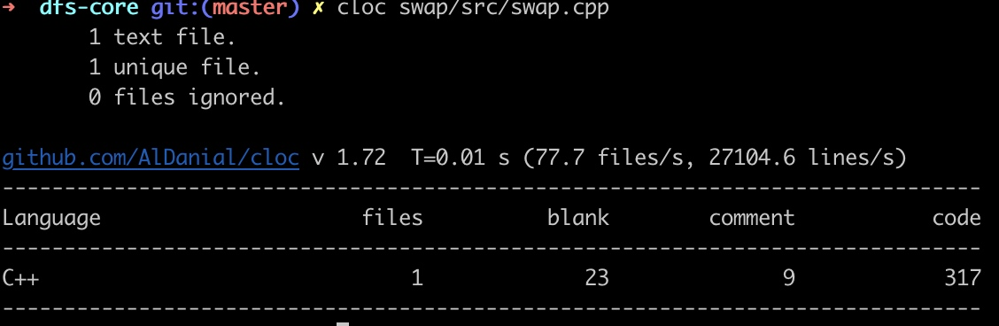
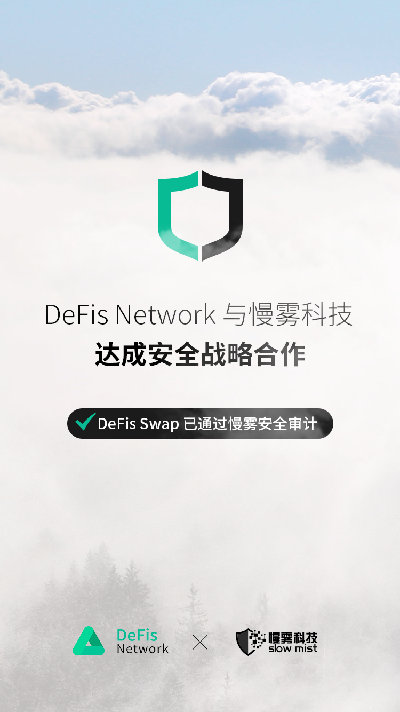
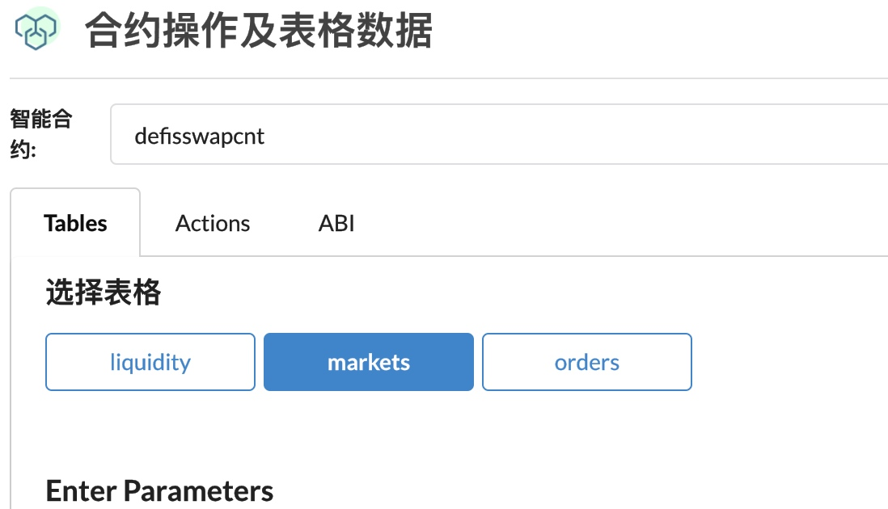
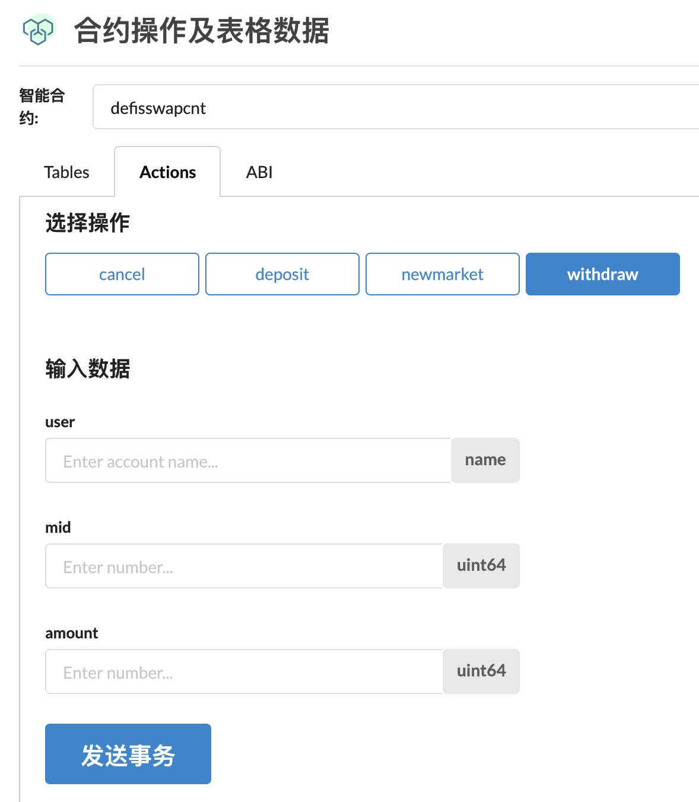

## DFS的去中心化之路1

将DFS项目做到完全的去中心化，是我们所追求的终极目标。

至于如何做到完全的去中心化，是一条需要我们拿出勇气和决心主动踏出第一步，并一直走下去的路。

对一个复合型的DeFi项目来说，完全的去中心化不太可能一蹴而就，渐进式的去中心化，是目前的折衷方案。

DFS的去中心化之路的第一步，选择先从Swap合约的多签开始。

## DFS Swap 介绍

DFS Swap，是一个基于恒定乘积做市商算法的去中心化交易所。

这种人人可以提供资金共建交易深度、共享交易手续费的去中心化交易所模型，最初由以太坊V神提出理论，由以太坊社区的Uniswap项目实现。

这种基于单一数学公式创造出来的算法型人机交易所模型，点燃了去中心化交易所的革命火花。

Uniswap已经用日流水过亿的成绩告诉我们，什么是真正的去中心化交易所。

今年，已经有一系列数不清的 xxSwap 项目井喷而出，真真假假令人难以分辨，赶着DeFi热度，日行一骗，屡试不爽。

而DFS Swap不过是其中之一，不同的是，我们确实是正经的在做项目。

DFS Swap采用了和Uniswap一样的数学公式，以317行干净的代码，在性能更好的EOS公链上，实现了集自主上币、人人做市、代币互换的功能完备的去中心化交易所。




然后，在 DFS Swap core 保持代码极简的基础上，通过外部logic合约，在完全不影响DFS Swap core的交易和做市功能的情况下，做后续一系列业务功能的拓展。

比如DFS Pool矿池、DFS Link预言机等等。

DFS Swap，深得DeFi开发设计的各种最佳实践。在经历过上线后33小时内9500万美金的日流水之后，直到现在，也没遭遇过任何异常。

安全审计上，已经经过慢雾、派盾的审计。



这是一份，逐行逐字逐个标点符号，都被反复测试过的代码。

合约内含 3个table 用于存数据，4个action 用于调用合约的功能。此外再无其他功能。

因为相信数学和代码，因此合约内无暂停、无风控、无后门、无admin key。

Swap是基于极简的数学模型创建的，输入x必然输出y，不存在输入了x，算不出y或算错y的情况。In math we trust 。对于DFS Swap项目，在权限多签以后，不再需要相信我，相信数学就行了。它的原理，就像1+1=2 那么朴实无华且枯燥。


[合约table数据和action接口链上查看链接](https://bloks.io/account/defisswapcnt?tab=Tables&account=defisswapcnt&scope=defisswapcnt&limit=100&table=markets&loadContract=true)






摘录来自以太坊DeFi上流社会的DeFi协议设计原则:

* 代码写得越长，越没有机会成为DeFi的底层基础设施。会增加第三方调用者的审计成本。如果按每行代码0.01%的bug率计算，写100行代码出bug几率是1%，写1000行代码出现bug几率是9.5%。安全审计也只是在此基础上，降低安全事故概率。

* DeFi协议层应保持开放性。对待一切接入方，一视同仁。不区分普通用户、第三方智能合约合约、或代理账号之类。

* DeFi协议，保持单一职责的软件设计原则。一份智能合约，只专注自己业务内的事。

* Permissionless: 免需可接入，任何人都可以成为系统的一份子。只需要拥有区块链账号。这是DeFi协议最终能否成为全球性的普惠金融基础设施的首要条件。

* Trustless : 相信代码、相信数学、相信密码学、相信区块链。可验证的信任。胜过任何强大的信用背书。

* Serverless : 弱化前端和服务端的重要性。前端可以去中心化。任何人都可以根据协议接口，开发自己的前端。只有合约在链上运行，链在项目就在。此外再无单点故障。这样的DeFi协议，理论上可向全球，提供全年无休止的金融服务。

* Priceless: 链上自带的交易报价体系。不依赖中心化报价。免除预言机攻击风险。

## DFS Swap的多签方案


### 执行命令:

```
cleos set account permission defisswapcnt owner '{"threshold": 5,"keys": [],"accounts":[
{"permission":{"actor":"b1","permission":"active"},"weight":1}
{"permission":{"actor":"dfsdeveloper","permission":"active"},"weight":2},
{"permission":{"actor":"eoscannonchn","permission":"active"},"weight":1},
{"permission":{"actor":"msig.tp","permission":"active"},"weight":1}, 
{"permission":{"actor":"wangruixiwww","permission":"active"},"weight":1},
{"permission":{"actor":"whaleex.com","permission":"active"},"weight":1},
]}'  -p defisswapcnt@owner
```
### 多签方选择

```
msig.tp@active       1/5
eoscannonchn@active  1/5
whaleex.com@active   1/5
wangruixiwww@active  1/5
b1@active            1/5
dfsdeveloper@active  2/5
```

多签的目的，是迈出实现完全去中心化终极目标路上的一大步。

目的在于防止内部风险。因此选择了以下几个不同类型代表，来参与多签。

社区代表: eoscannonchn EOS大户集团佳能社区
项目方代表: msig.tp    TP钱包
项目方+超级节点代表: whaleex.com  鲸交所
大户代表: wangruixiwww 王首富
DFS项目方: dfsdeveloper 猪弟
特别出席: b1     就那

### 权限多签说明: 

总阈值为5，权重分配，其他5个多签方1，项目方是2。
在这个多签权限分配下，合约账号发起任何一个链上的操作时，
如果是由项目方发起的话，至少还需要3个多签方的配合。
如果是由其他多签方发起的话，若没有项目方的配合，需要4方联合后再拉上b1一起。

合约账号权限多签，是实现完全去中心化之路上的一个过度方案。

当DFS Swap，经过时间和大资金的考验之后，在未来两到三年内。再择机发起真正的去中心化权限设置。

关于EOS智能合约部署后可修改，以至于被鄙视和诟病的问题，此处引用一篇社区老文章进行科普，有兴趣的可展开扩展阅读。

[【深入理解EOS】去中心化智能合约的权限解决方案](https://bihu.com/article/1045966)


## DFS代码全面开源的时间安排

俗话说 **无开源，不DeFi**，我们想延续这个从比特币沿袭到以太坊沿袭到以太坊DeFi生态的优良传统。 践行我们心中所追求的 Code is law 、In math we trust的区块链精神。

目前坚持从非核心智能合约到前端的每一行代码都开源。

现有的核心智能合约代码预计在项目平稳运行半年至一年以上后。再完整开源出来。主要因为是安全审计有点小贵，等回本还清花呗了再把代码送给大家吧。

**开发者负责编写安全的代码，用户选择使用安全的代码。未来基于区块链技术的开放式金融网络中的信任，一定是从开源里来的。**

请期待我们的全面开源计划。


## 总结

权限多签一小步，安全路上一大步。

代码无毒，放心食用。也不需要再问我会不会跑路了。EOS公链不倒，DFS Swap永存。


> --  By 兼职大丰收农场鱼塘管理员 猪弟@DFS 8.28

